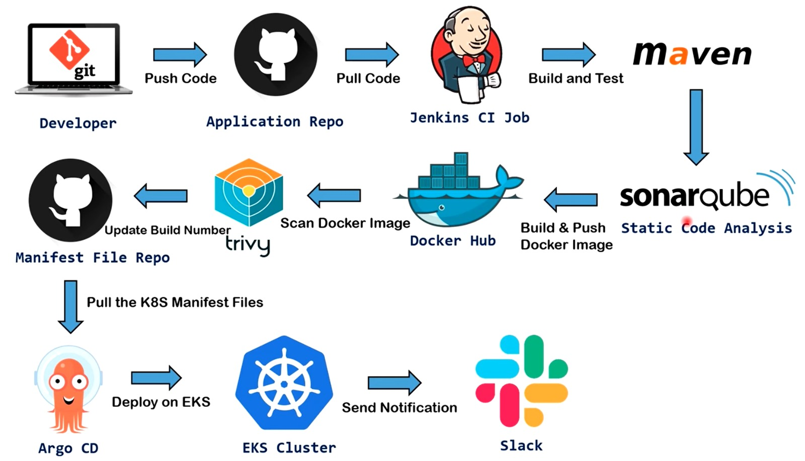
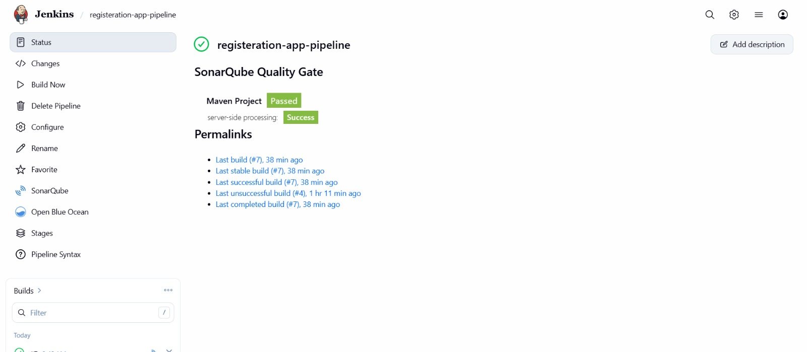
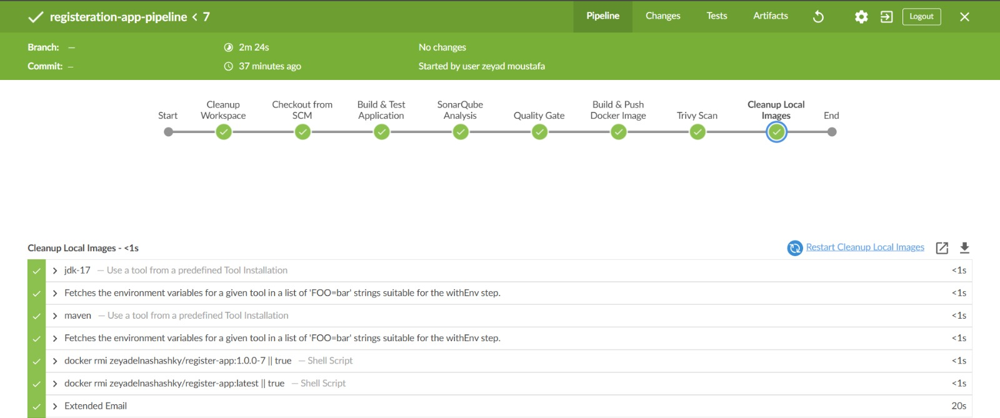
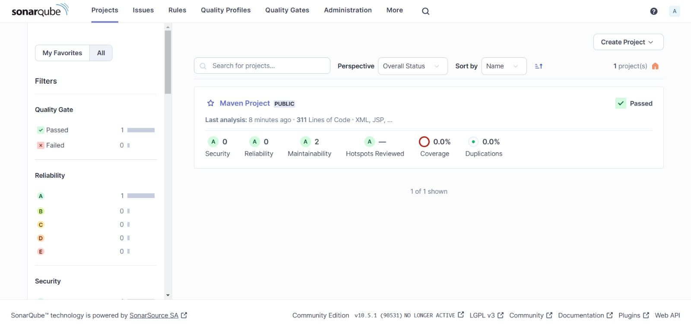
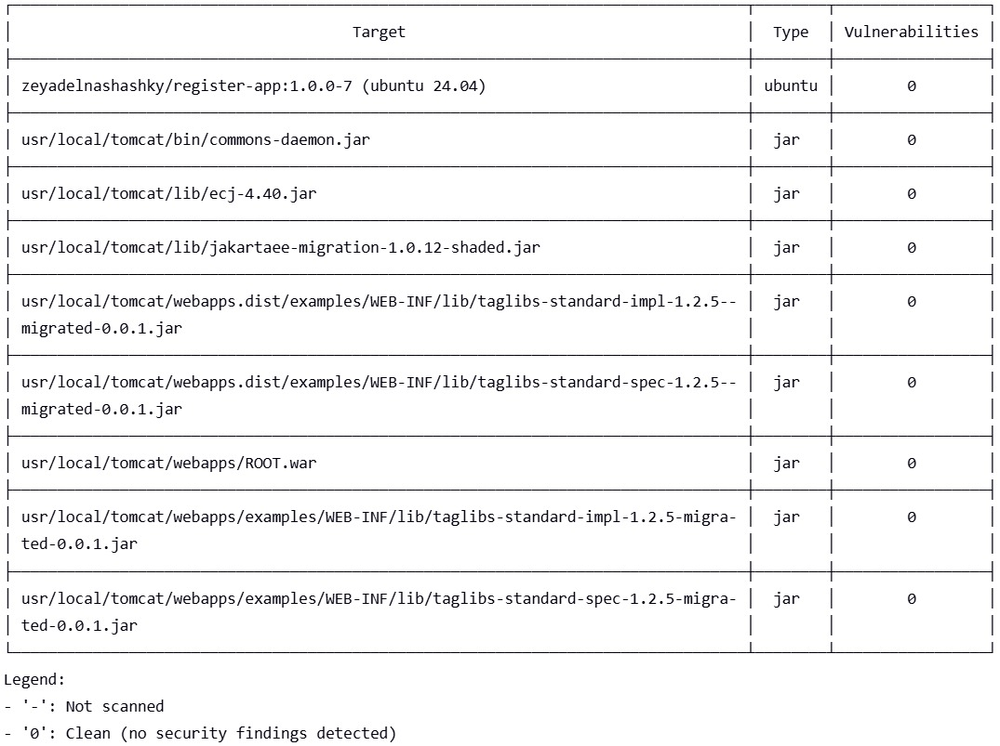
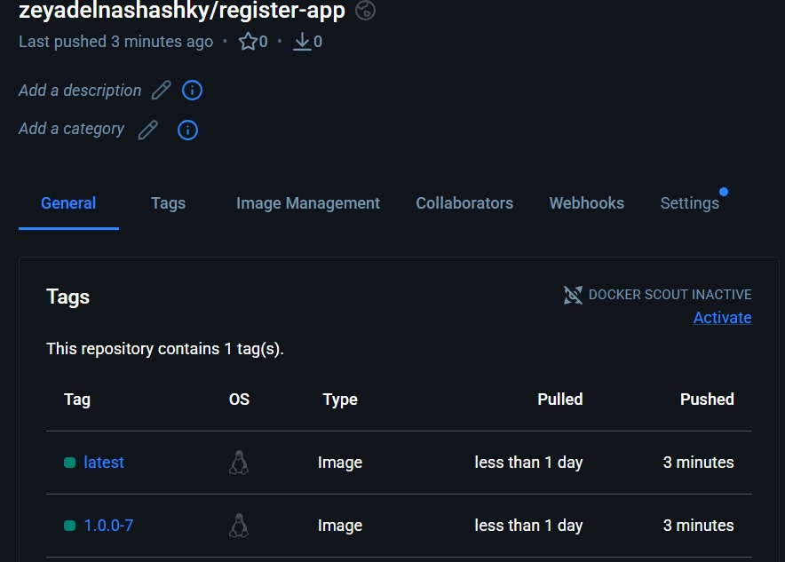
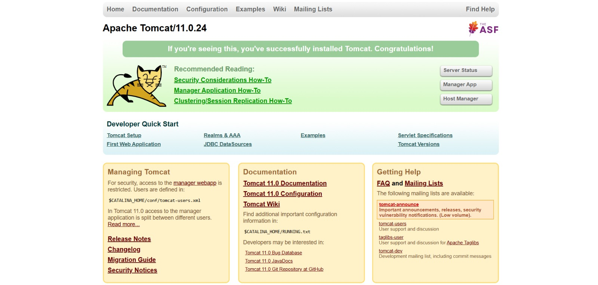
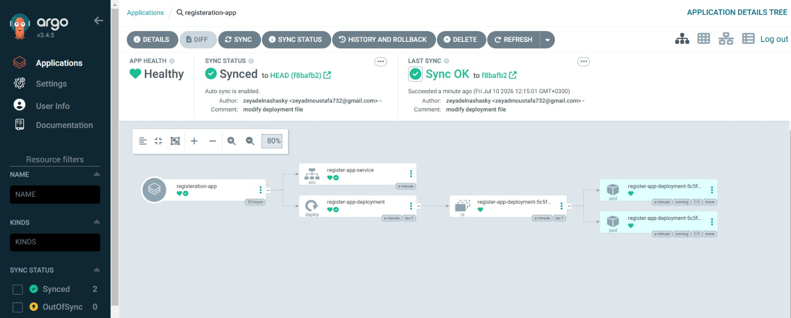
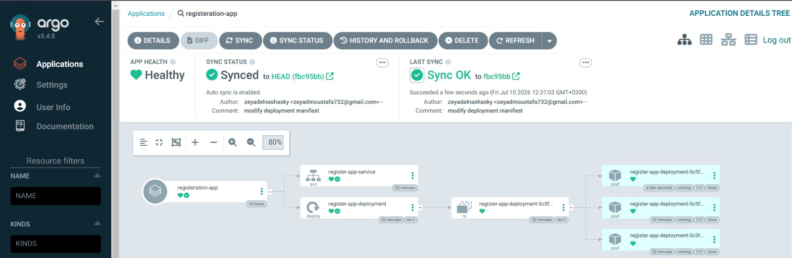

# End-to-End GitOps CI/CD Pipeline for Java App (Git -> Jenkins -> SonarQube -> Trivy -> Docker Hub -> ArgoCD -> EKS)

This repository contains the infrastructure, manifests, and automated pipelines for deploying a production-ready Java Web Application (`Registeration-App`). The project follows modern DevOps best practices, utilizing an automated **CI/CD GitOps workflow** with security gates embedded at every stage.

---

## 1. System Architecture Overview

The complete architecture of this deployment follows a strict GitOps philosophy, ensuring that the infrastructure state is fully declared in Git and synchronized automatically to an AWS EKS Cluster.

### **Workflow Breakdown:**
1. **Code Commit:** The developer pushes code changes to the **Application Code Repository** hosted on GitHub.

2. **Continuous Integration (Jenkins):**

   * Jenkins automatically hooks into the repository, pulling the latest code to execute the automated CI pipeline.

   * **Build & Test:** Code is compiled and tested utilizing Apache Maven.

   * **Static Code Analysis:** SonarQube inspects code quality, tracking security hotspots, reliability, and technical debt.

   * **Quality Gate:** Jenkins evaluates code viability against predefined SonarQube rules before proceeding.

   * **Containerization:** Upon passing quality criteria, the application is containerized inside an **Apache Tomcat 11** base environment.

   * **Security Scanning:** **Trivy** performs a deep vulnerability scan on the built Docker image.

   * **Image Distribution:** The safe, scanned container image is pushed to **Docker Hub** tagged with both `latest` and a unique build version string (`1.0.0-<BUILD_NUMBER>`).

4. **Manifest Update:** Jenkins automates a commit back to the **Kubernetes Manifest Repository** on GitHub, updating the application deployment descriptor with the newly generated image tag.

5. **GitOps Deployment (ArgoCD):**

   * **ArgoCD** continuously polls the Manifest File Repository (serving as the *Single Source of Truth*).

   * Upon detecting a diff between the live cluster state and Git, ArgoCD automatically triggers a declarative deployment synchronization.

   * Application resources are created/updated within a managed **Amazon EKS (Elastic Kubernetes Service)** cluster.
     
7. **System Observability & Notifications:** A status summary is pushed directly to a dedicated **Slack** channel to provide real-time updates regarding deployment lifecycle success or failures.

---

## 2. Continuous Integration Pipeline (Jenkins & Quality Gates)

### **Succeeded Pipeline Execution**

A Succeeded Pipeline Execution indicates that the entire declarative workflow has successfully run from end to end without a single step failure, confirming that the code compiled via Maven, passed all SonarQube quality gate parameters, sailed through Trivy container security scans, and published clean immutable image tags out to your Docker Hub registry.

### **Pipeline Execution Stages**

The Jenkins pipeline is completely modular and declarative, enforcing quality control at every phase of execution.

* **Cleanup Workspace:** Ensures a fresh, sterile environment before pull operations.

* **Checkout from SCM:** Synchronizes the latest commit from the application repo.

* **Build & Test Application:** Compiles dependencies and assets via Maven.

* **SonarQube Analysis & Quality Gate:** Executes static code analysis and blocks deployment if quality thresholds fail.

* **Build & Push Docker Image:** Builds the runtime container layer and pushes it securely to Docker Hub.

* **Trivy Scan:** Scans filesystem dependencies and runtime image layers for active security CVEs.

* **Cleanup Local Images:** Prunes temporary workspace Docker data to safeguard worker storage.

### **SonarQube Static Analysis Summary**

Our automated quality gate passed successfully, validating that the underlying code has clean health markers:

* **0 Security Issues** detected.

* **0 Reliability Bugs** discovered.

* **2 Maintainability Code Smells** identified (low priority).

* **0.0% Duplications** across the codebase.

---

## 3. Container Security & Image Registry

### **Trivy Image Security Scan Output**
Before distributing the container, **Trivy** runs deep vulnerability analysis across all system packages (Ubuntu 24.04) and Java JAR dependencies (`commons-daemon.jar`, `ecj-4.40.jar`, etc.). The scan returned a **completely clean record with 0 security vulnerabilities**, ensuring compliance before shipping.

### **Docker Hub Image Repository**

The final validated image is stored on Docker Hub under the registry profile: `zeyadelnashashky/register-app`. Each build automatically outputs a multi-tag strategy maintaining an immutable historic tag (`1.0.0-7`) alongside a rolling pointer (`latest`).

### **Application Execution Layer**

The web microservice executes seamlessly over a baseline installation of **Apache Tomcat/11.0.24**, optimized for fast boot speeds and high concurrency request processing.

---

## 4. GitOps Deployment & State Synchronization (ArgoCD)

This architecture relies heavily on **ArgoCD** as its deployment controller, enforcing **GitHub as the Single Source of Truth**. Any structural adjustments to runtime infrastructure are managed via pull-requests to the manifest file repo.

### **Initial State: Two Replicas Active**

Initially, the `deployment.yaml` manifest configured a target workload of **two running pod replicas**. ArgoCD matched this state, registering a perfectly healthy, synchronized mesh architecture routing traffic through a `register-app-service` load balancer.

### **Live Scalability: Elevating to Three Replicas via Git**
To scale up resources and handle incoming load requirements, a change was committed directly to the `deployment.yaml` file on GitHub, bumping the replica pool size up to **3**.

* **The GitOps Trigger:** Because Auto-Sync is enabled, ArgoCD intercepted the new commit hash (`fbc95bb`) authored by `zeyadelnashashky`.

* **Automated Rollout:** ArgoCD instantly registered a structural diff against the active EKS cluster. It automatically spawned a **third pod instance** (`register-app-deployment-5c5f...`) to reach parity without any manual `kubectl` intervention.

---

## 5. Technology Stack Summary

* **Source Control Management:** Git & GitHub

* **Continuous Integration Platform:** Jenkins

* **Build Automation:** Apache Maven

* **Static Application Security Testing (SAST):** SonarQube

* **Vulnerability Assessment:** Trivy

* **Application Runtime Host:** Apache Tomcat 11

* **Image Registry:** Docker Hub

* **Continuous Delivery Engine:** ArgoCD (GitOps)
* **Cloud Orchestration Cluster:** Amazon EKS (Kubernetes)
* **Team Collaboration Alerts:** Slack Notifications
